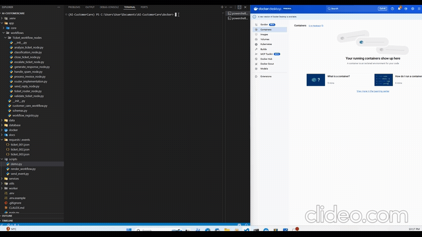
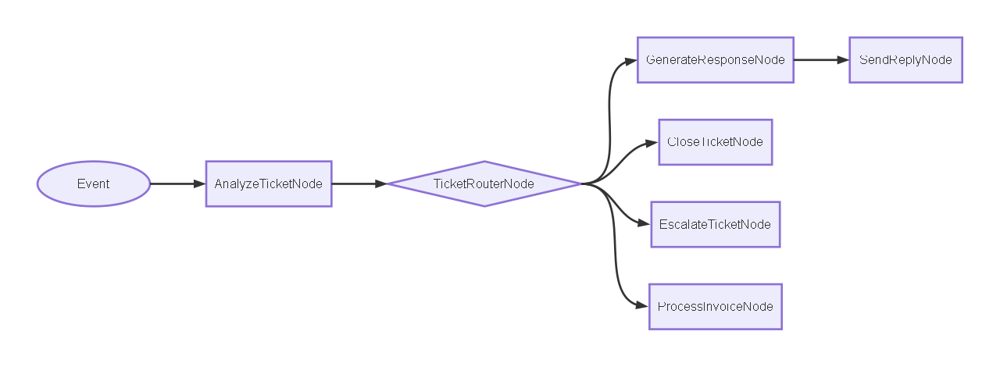

# Support Client IA

**Automatisation du traitement de tickets client par IA — démonstrateur technique complet**


---

## C'est quoi ?

Un Proof of Concept (POC) qui automatise le traitement des tickets client. Un email client entre dans le système, trois analyses IA s'exécutent simultanément, et le ticket ressort avec une réponse rédigée automatiquement — ou transmis à un agent humain si le cas le nécessite. Chaque décision est tracée et consultable via API.

> *Projet de démonstration — non déployé en production. L'objectif est de prouver que chaque composant fonctionne, que l'architecture est solide et scalable.*

---

## Démonstration



---

## Pourquoi c'est utile ?

Les équipes de support client traitent chaque jour des tickets répétitifs : suivi de commande, demande de remboursement, problème de compte. Ce système IA automatise ce premier niveau de traitement :

- Les questions courantes reçoivent une réponse immédiate, rédigée à partir de la base de connaissances interne de l'entreprise.
- Les cas sensibles (remboursement, plainte) sont détectés automatiquement et transmis à un agent humain avec le contexte déjà préparé.
- Les messages parasites (spam, bots) sont filtrés et fermés systématiquement.

**Ce projet montre la capacité à concevoir, assembler et faire fonctionner un système IA complet.**

---

## Ce que j'ai construit

```
Email client
    │
    ▼
[FastAPI] ──────────────────────────────────► [Base de données Supabase]
    │                                              (tickets + résultats)
    ▼
[Redis] (file d'attente)
    │
    ▼
[Celery Worker]
    │
    ▼
[Workflow Engine]
    │
    ├──► Classification de l'intention ──┐
    ├──► Détection de spam              ├──► [Routeur]
    └──► Validation du ticket ──────────┘        │
                                                  ├── Question générale → [Génère réponse] ◄──► [Base vectorielle]
                                                  ├── Remboursement     → Escalade humaine
                                                  ├── Facturation       → Service facturation
                                                  └── Spam              → Fermeture automatique
```
                                                  


### Processus détaillé

1. Un ticket client est envoyé sur l'endpoint de l'API (pouvant être automatiquement transmis à l'aide d'un webhook)
2. Le ticket est enregistré daans la base de données et publié dans la file d'attente Redis.
3. Le worker Celery consomme la tâche et lance le moteur de workflow.
4. Trois agents IA s'exécutent **en parallèle** : classification de l'intention, détection de spam, validation.
5. Le routeur lit les résultats et choisit le traitement adapté.
6. Pour les demandes plus spécifiques liées à l'entreprise, le système recherche dans la base de connaissances les 5 passages les plus proches sémantiquement, puis génère une réponse. *(principe du RAG — Retrieval-Augmented Generation)*
7. La réponse et toutes les métadonnées sont sauvegardées et consultables via l'endpoint de l'API.

---

## Stack technique

### Backend

| Outil | Rôle |
|-------|------|
| **FastAPI** | Reçoit les tickets via HTTP et expose les résultats |
| **Celery** | Exécute les workflows en arrière-plan, hors du cycle de requête |
| **Redis** | File d'attente entre l'API et le worker |
| **SQLAlchemy** | Accès structuré à la base de données PostgreSQL |

### IA

| Outil | Rôle |
|-------|------|
| **pydantic-ai** | Orchestre les agents IA avec des sorties structurées et typées |
| **OpenAI GPT-4.1** | Modèle de langage utilisé pour l'analyse et la génération de réponses |
| **OpenAI text-embedding-3-small** | Transforme le texte en vecteurs numériques pour la recherche sémantique |
| **pgvector** | Extension PostgreSQL pour retrouver rapidement les documents les plus similaires |
| **Supabase (PostgreSQL)** | Stockage des tickets, résultats et base de connaissances |

### Infrastructure

| Outil | Rôle |
|-------|------|
| **Docker Compose** | Orchestre les 3 conteneurs (API, worker, Redis) en une seule commande |
| **uv** | Gestionnaire de dépendances Python rapide et reproductible |

---

## Fonctionnalités clés

- **Analyse en parallèle** — 3 agents IA s'exécutent simultanément sur chaque ticket, au lieu de tourner l'un après l'autre.
- **Routage conditionnel** — le système choisit automatiquement le traitement adapté selon l'intention détectée : réponse générée, escalade humaine, transfert facturation, ou fermeture.
- **RAG - Réponses ancrées dans des documents internes** — le système consulte la base de connaissances avant de rédiger, pour ne jamais inventer d'information.
- **Architecture extensible en nœuds** — ajouter un nouveau type d'analyse se fait sans modifier le moteur existant.
- **Compatible multi-fournisseurs IA** — OpenAI, Anthropic, Gemini, Azure, Bedrock et Ollama sont interchangeables sans changer la logique métier.
- **Traçabilité complète** — intention, score de confiance, documents récupérés et réponse générée sont persistés en base et consultables via l'API.

---

## Résultats & métriques

| Indicateur | Valeur |
|------------|--------|
| Analyses IA par ticket | 3, exécutées en parallèle |
| Documents récupérés par requête | 5, sélectionnés par similarité sémantique |
| Dimensions des vecteurs d'embedding | 1 536 (text-embedding-3-small) |
| Catégories d'intention reconnues | 4 (question générale, produit, facturation, remboursement) |
| Fournisseurs IA interchangeables | 6 (OpenAI, Anthropic, Gemini, Azure, Bedrock, Ollama) |
| Services Docker | 3 conteneurs indépendants avec healthcheck |

---

*Workflow inspiré du cours [Datalumina GenAI Launchpad](https://datalumina.com). Tout le code de ce dépôt a été écrit indépendamment.*
